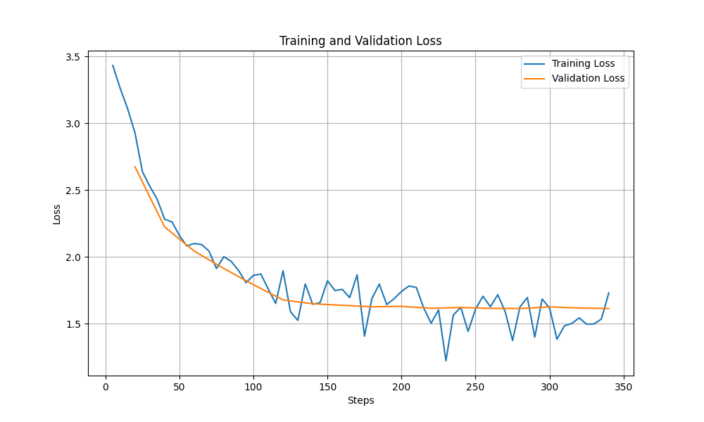

# Fine-tune Qwen2.5-1.5B on AI Medical Chatbot Dataset

Fine-tuning **Qwen2.5-1.5B-Instruct** on the [ruslanmv/ai-medical-chatbot](https://huggingface.co/datasets/ruslanmv/ai-medical-chatbot) dataset using **LoRA/QLoRA** for medical Q&A tasks.

## 🎯 Overview

| Component | Details |
|-----------|---------|
| **Base Model** | [Qwen/Qwen2.5-1.5B-Instruct](https://huggingface.co/Qwen/Qwen2.5-1.5B-Instruct) |
| **Dataset** | [ruslanmv/ai-medical-chatbot](https://huggingface.co/datasets/ruslanmv/ai-medical-chatbot) |
| **Method** | QLoRA (4-bit quantization + LoRA) |
| **Framework** | Transformers, PEFT, TRL |

## 📊 Experiment Results

| Experiment | LoRA Rank | Alpha | Best Eval Loss | Perplexity |
|------------|-----------|-------|----------------|------------|
| lora_r8_alpha16 | 8 | 16 | 1.6134 | 5.02 |
| lora_r16_alpha32 | 16 | 32 | 1.6121 | 5.01 |
| **lora_r32_alpha64** | 32 | 64 | **1.6112** | **5.00** |

### Training Curves


## 🏗️ Project Structure

```
finetune-qwen2.5-1.5b-ai-medical-chatbot/
├── configs/
│   └── config.yml          # Training configuration
├── src/
│   ├── data/               # Data loading & preprocessing
│   │   ├── load_dataset.py
│   │   └── preprocess.py
│   ├── models/             # Model & training
│   │   ├── qwen_loader.py
│   │   └── train_lora.py
│   ├── evaluation/         # Metrics & evaluation
│   │   └── metrics.py
│   └── utils/              # Logging utilities
├── scripts/
│   ├── train_medical.py    # Single training run
│   ├── train_comparison.py # Multiple experiments
│   ├── run_inference.py    # Inference script
│   └── eval_medical.py     # Evaluation script
├── notebooks/              # Jupyter notebooks
├── outputs/                # Checkpoints & results
└── docs/
    └── theory_answers.md   # Theory Q&A
```

## 🚀 Quick Start

### 1. Installation

```bash
# Clone repository
git clone https://github.com/xt2201/finetune-qwen2.5-1.5b-ai-medical-chatbot.git
cd finetune-qwen2.5-1.5b-ai-medical-chatbot

# Install dependencies
pip install -r requirements.txt
```

### 2. Configuration

Create `.env` file for Weights & Biases logging:
```bash
WANDB_API_KEY=your_api_key
HF_TOKEN=your_hf_token  # Optional
```

### 3. Training

```bash
# Single experiment
python scripts/train_medical.py

# Run all experiments (different LoRA configs)
python scripts/train_comparison.py
```

### 4. Inference

```bash
# Test base model
python scripts/run_inference.py

# Evaluate fine-tuned model
python scripts/eval_medical.py
```

## ⚙️ Configuration

Key hyperparameters in `configs/config.yml`:

```yaml
# LoRA Configuration
lora:
  r: 16                    # LoRA rank
  lora_alpha: 32           # Scaling factor
  lora_dropout: 0.15       # Dropout for regularization
  target_modules:          # Layers to apply LoRA
    - q_proj, k_proj, v_proj, o_proj
    - gate_proj, up_proj, down_proj

# Training Configuration
training:
  learning_rate: 1e-4
  num_train_epochs: 10
  per_device_train_batch_size: 2
  gradient_accumulation_steps: 8  # Effective batch = 16
  lr_scheduler_type: cosine_with_restarts
  weight_decay: 0.05
  warmup_ratio: 0.1
```

## 🔧 Key Features

- **4-bit Quantization**: NF4 + Double Quantization for memory efficiency
- **LoRA Fine-tuning**: Only ~8M trainable parameters vs 1.5B total
- **NEFTune**: Noise injection for better generalization
- **Early Stopping**: Automatic stop when validation loss plateaus
- **W&B Integration**: Real-time training monitoring

## 📈 Memory Usage

| Component | Memory |
|-----------|--------|
| Base Model (4-bit) | ~0.75 GB |
| LoRA Adapters | ~10-50 MB |
| Training Total | ~4-6 GB VRAM |

## 📚 Theory

Detailed answers to theoretical questions about LLM fine-tuning can be found in [`docs/theory_answers.md`](docs/theory_answers.md).

## 📝 License

MIT License

## 👤 Author

**Nguyen Xuan Thanh**
